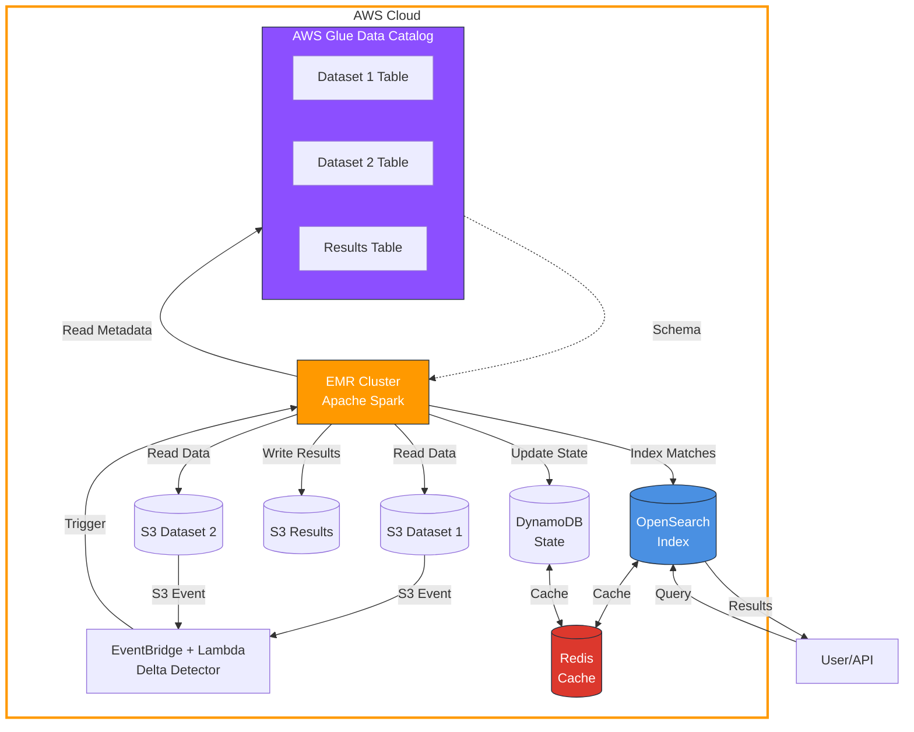

# Person Matching Solution - AWS Distributed Architecture

## 📋 Visão Geral

Solução escalável para comparação e matching de milhões de registros de pessoas utilizando algoritmos de similaridade (Levenshtein, Jaro-Winkler, Soundex) e computação distribuída na AWS.

### Características Principais

- ✅ **Processamento Distribuído**: Apache Spark em EMR para processar terabytes de dados
- ✅ **Detecção de Deltas**: Processa apenas alterações incrementais para eficiência
- ✅ **Indexação Rápida**: OpenSearch para busca instantânea por `nr_documento`
- ✅ **Cache Inteligente**: Redis/ElastiCache para deduplicação e cache
- ✅ **Infraestrutura como Código**: Terraform para toda infraestrutura AWS
- ✅ **Auto-scaling**: Escalabilidade automática baseada em carga
- ✅ **Multi-algoritmos**: Combinação de Levenshtein, Jaro-Winkler e Soundex

## 🏗️ Arquitetura



## 📊 Entidade Pessoa

```python
{
    "nome_completo": str,      # Nome completo da pessoa
    "data_nascimento": str,    # Formato: YYYY-MM-DD
    "nr_documento": str,       # CPF, RG, etc.
    "status": str              # Ativo, Inativo, etc.
}
```

## 🚀 Quick Start

### Pré-requisitos

- Docker & Docker Compose
- Terraform >= 1.5.0
- AWS CLI configurado
- Python 3.11+

### Desenvolvimento Local

```bash
# 1. Clone o repositório
git clone <repo-url>
cd poc_lucene

# 2. Inicie os containers
docker-compose up -d

# 3. Acesse as interfaces
# Spark Master UI: http://localhost:8080
# OpenSearch: http://localhost:9200
# OpenSearch Dashboards: http://localhost:5601
# Jupyter: http://localhost:8888
# LocalStack: http://localhost:4566
```

### Deploy na AWS

```bash
# 1. Inicialize o Terraform
cd terraform
terraform init

# 2. Configure as variáveis
cp terraform.tfvars.example terraform.tfvars
# Edite terraform.tfvars com seus valores

# 3. Planeje e aplique
terraform plan
terraform apply

# 4. Upload dos scripts para S3
aws s3 cp ../app/person_matcher.py s3://$(terraform output -raw s3_bucket_scripts)/
aws s3 cp ../app/opensearch_indexer.py s3://$(terraform output -raw s3_bucket_scripts)/

# 5. Execute os crawlers do Glue
aws glue start-crawler --name person-matching-dataset1-crawler
aws glue start-crawler --name person-matching-dataset2-crawler
```

## 🔧 Componentes

### 1. Person Matcher (PySpark)

Algoritmo principal de matching distribuído:

- **Blocking Strategy**: Reduz espaço de comparação usando primeira letra + ano nascimento
- **Levenshtein Distance**: Similaridade de strings (0-1)
- **Jaro-Winkler**: Otimizado para nomes próprios
- **Soundex**: Matching fonético
- **Score Composto**: Média ponderada dos algoritmos

**Pesos do Score:**
```
similarity_score = 
    name_levenshtein * 0.25 +
    name_jaro_winkler * 0.25 +
    name_soundex * 0.15 +
    date_similarity * 0.25 +
    document_exact_match * 0.10
```

### 2. Delta Detector (Lambda)

Detecta mudanças nos datasets e processa apenas deltas:

- Monitora S3 via eventos
- Calcula hash de metadata
- Compara com estado anterior (DynamoDB)
- Dispara EMR step apenas se houver mudanças
- Executa 4x ao dia via CloudWatch Events

### 3. OpenSearch Indexer

Indexa resultados para busca rápida:

- Index otimizado para busca por `nr_documento`
- Analyzers customizados para nomes
- Busca bidirecional (nr_documento_1 ou nr_documento_2)
- Ordenação por `similarity_score`

### 4. Infraestrutura AWS

**EMR Cluster:**
- Master: m5.xlarge
- Core: m5.2xlarge (3-10 nodes auto-scaling)
- Spark 3.x com otimizações
- Integração com Glue Catalog

**OpenSearch:**
- r6g.xlarge.search (3 nodes)
- 100GB EBS por node
- Multi-AZ para alta disponibilidade
- VPC isolada

**ElastiCache (Redis):**
- cache.r6g.xlarge (2 nodes)
- Cluster mode habilitado
- Usado para cache e deduplicação

## 📈 Performance e Escalabilidade

### Otimizações Implementadas

1. **Blocking Strategy**: Reduz comparações de O(n²) para O(n log n)
2. **Particionamento**: Dados particionados por blocking_key
3. **Broadcast Joins**: Para datasets menores
4. **Adaptive Query Execution**: Spark AQE habilitado
5. **Dynamic Allocation**: Executores alocados sob demanda
6. **Caching**: Redis para resultados intermediários

### Capacidade Estimada

| Dataset Size | Processing Time | EMR Nodes | Custo/Run (est.) |
|--------------|----------------|-----------|------------------|
| 10M records  | ~30 min        | 3 core    | $15              |
| 100M records | ~4 hours       | 6 core    | $80              |
| 1B records   | ~24 hours      | 10 core   | $400             |

## 🔍 Como Buscar Resultados

### Via OpenSearch REST API

```bash
# Buscar matches por nr_documento
curl -X POST "https://<opensearch-endpoint>/_search" \
  -H 'Content-Type: application/json' \
  -d '{
    "query": {
      "bool": {
        "should": [
          {"term": {"nr_documento_1": "12345678900"}},
          {"term": {"nr_documento_2": "12345678900"}}
        ]
      }
    },
    "sort": [{"similarity_score": "desc"}],
    "size": 10
  }'
```

### Via Python

```python
from opensearchpy import OpenSearch

client = OpenSearch(
    hosts=[{'host': 'your-endpoint.us-east-1.es.amazonaws.com', 'port': 443}],
    use_ssl=True
)

# Buscar matches
response = client.search(
    index='person-matches',
    body={
        'query': {
            'bool': {
                'should': [
                    {'term': {'nr_documento_1': '12345678900'}},
                    {'term': {'nr_documento_2': '12345678900'}}
                ]
            }
        },
        'sort': [{'similarity_score': {'order': 'desc'}}],
        'size': 10
    }
)

for hit in response['hits']['hits']:
    print(hit['_source'])
```

## 🔄 Pipeline de Execução

```
1. Upload de dados → S3 Buckets
2. S3 Event → Lambda Delta Detector
3. Lambda verifica mudanças (DynamoDB)
4. Se houver mudanças → EMR Step
5. Spark lê via Glue Catalog
6. Processamento distribuído com blocking
7. Resultados → S3 (Parquet)
8. Indexação → OpenSearch
9. Busca disponível via API
```

## 🛡️ Segurança

- ✅ Buckets S3 com criptografia AES-256
- ✅ OpenSearch em VPC privada
- ✅ Redis com criptografia em trânsito e repouso
- ✅ IAM roles com princípio de menor privilégio
- ✅ VPC endpoints para S3 e DynamoDB
- ✅ Security groups restritivos
- ✅ Logs centralizados no CloudWatch

## 💰 Estimativa de Custos (Mensal)

| Componente | Configuração | Custo/Mês |
|------------|--------------|-----------|
| EMR (on-demand, 8h/dia) | 1 master + 3 core | $800 |
| OpenSearch | 3x r6g.xlarge | $900 |
| ElastiCache | 2x cache.r6g.xlarge | $450 |
| S3 Storage | 5TB | $115 |
| Data Transfer | 1TB | $90 |
| Lambda | 1M invocations | $0.20 |
| DynamoDB | On-demand | $25 |
| **TOTAL** | | **~$2,380/mês** |

*Nota: Use EMR Spot Instances para reduzir custos em ~70%*

## 🧪 Testes

### Teste Local com Docker

```bash
# Gerar dados de teste
python scripts/generate_test_data.py --records 10000

# Executar matching local
docker-compose exec app python /app/person_matcher.py \
  person_data dataset1 dataset2 /data/output 0.7
```

### Teste de Performance

```bash
# Executar benchmark
python scripts/benchmark.py \
  --size 1000000 \
  --workers 4 \
  --threshold 0.7
```

## 📚 Estrutura do Projeto

```
poc_lucene/
├── app/
│   ├── person_matcher.py          # Spark job principal
│   ├── opensearch_indexer.py      # Indexador OpenSearch
│   └── requirements.txt            # Dependências Python
├── lambdas/
│   └── delta_detector.py           # Lambda de detecção de deltas
├── terraform/
│   ├── main.tf                     # Configuração principal
│   ├── variables.tf                # Variáveis
│   ├── vpc.tf                      # VPC e networking
│   ├── emr.tf                      # EMR cluster
│   ├── opensearch.tf               # OpenSearch domain
│   ├── elasticache.tf              # Redis cluster
│   ├── s3.tf                       # S3 buckets
│   ├── glue.tf                     # Glue catalog
│   ├── dynamodb.tf                 # DynamoDB tables
│   ├── lambda.tf                   # Lambda functions
│   └── outputs.tf                  # Outputs
├── docker/
│   ├── Dockerfile.app              # Container aplicação
│   └── docker-compose.yml          # Orquestração local
├── localstack-init/
│   └── init.sh                     # Script init LocalStack
├── docs/
│   └── architecture.md             # Documentação detalhada
└── README.md                       # Este arquivo
```

## 🔨 Comandos Úteis

```bash
# Terraform
terraform plan -var-file=prod.tfvars
terraform apply -auto-approve
terraform destroy

# AWS CLI
aws emr list-clusters --active
aws emr describe-step --cluster-id <id> --step-id <step-id>
aws s3 sync ./data/ s3://bucket/path/

# Docker
docker-compose up -d
docker-compose logs -f spark-master
docker-compose down -v

# Spark
spark-submit \
  --master spark://spark-master:7077 \
  --deploy-mode client \
  /app/person_matcher.py
```

## 🤝 Contribuindo

1. Fork o projeto
2. Crie uma branch (`git checkout -b feature/nova-feature`)
3. Commit suas mudanças (`git commit -am 'Add nova feature'`)
4. Push para a branch (`git push origin feature/nova-feature`)
5. Abra um Pull Request

## 📄 Licença

Este projeto está sob a licença MIT.

## 📞 Suporte

Para questões e suporte:
- Abra uma issue no GitHub
- Email: suporte@exemplo.com

---

**Desenvolvido com ❤️ usando AWS, Spark, OpenSearch e Terraform**
