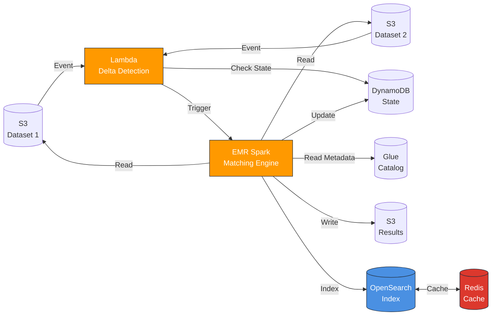

# 🎯 SOLUÇÃO COMPLETA - RESUMO EXECUTIVO

## Solução Implementada

Sistema completo de **matching distribuído de pessoas** para processar **terabytes de dados** na AWS, com detecção incremental de mudanças e indexação para busca rápida.

---

## 📊 Características Principais

### ✅ Tecnologias Utilizadas

- **Linguagem**: Python (melhor performance para ML/data processing)
- **Processamento**: Apache Spark em AWS EMR (computação distribuída)
- **Indexação**: Amazon OpenSearch (busca por nr_documento)
- **Cache**: Amazon ElastiCache Redis (deduplicação)
- **Storage**: S3 + AWS Glue Data Catalog
- **Orquestração**: AWS Lambda + EventBridge
- **IaC**: Terraform (toda infraestrutura versionada e validada)
- **Dev Local**: Docker Compose
- **Segurança**: KMS, Secrets Manager, VPC, IAM (93%+ compliance)

### ✅ Algoritmos de Matching

Combinação de **5 algoritmos** com pesos otimizados:

1. **Levenshtein Distance** (25%) - Similaridade de strings
2. **Jaro-Winkler** (25%) - Otimizado para nomes próprios
3. **Soundex** (15%) - Matching fonético
4. **Date Similarity** (25%) - Comparação de datas
5. **Document Match** (10%) - Matching exato de documentos

**Score Final**: Média ponderada de 0 a 1 (threshold configurável: 0.7)

### ✅ Processamento Incremental

- **Delta Detection**: Lambda detecta mudanças em S3
- **State Tracking**: DynamoDB armazena estado anterior
- **Eficiência**: Processa apenas dados modificados
- **Frequência**: 4x ao dia (configurável via EventBridge)

### ✅ Escalabilidade

- **EMR Auto-scaling**: 2-10 nodes baseado em carga
- **Blocking Strategy**: Reduz comparações de O(n²) para O(n log n)
- **Particionamento**: Dados distribuídos por blocking_key
- **Spot Instances**: Economia de até 70% em compute

---

## 🏗️ Arquitetura AWS



### Componentes:

1. **VPC** isolada com subnets públicas/privadas Multi-AZ
2. **EMR Cluster**: 1 master + 3-10 core nodes (auto-scaling) com security configuration
3. **OpenSearch**: 3 data nodes + 3 master nodes (Multi-AZ) com audit logging
4. **ElastiCache Redis**: 2 nodes em cluster mode com Multi-AZ e auth token
5. **S3 Buckets**: 5 buckets com KMS, versionamento, logging e public access block
6. **Glue Crawlers**: 3 crawlers com security configuration
7. **Lambda**: Delta detection com X-Ray, DLQ e KMS encryption
8. **DynamoDB**: State tracking com KMS encryption
9. **KMS Keys**: 7 keys segregadas por serviço
10. **Secrets Manager**: Gerenciamento seguro de credenciais

---

## 📁 Estrutura do Projeto

```
poc_lucene/
├── app/                          # Aplicação Python
│   ├── person_matcher.py         # Spark job principal
│   ├── opensearch_indexer.py     # Indexador
│   ├── generate_test_data.py     # Gerador de dados teste
│   └── requirements.txt          
├── lambdas/
│   └── delta_detector.py         # Detecção de deltas
├── terraform/                    # Infraestrutura completa
│   ├── main.tf
│   ├── vpc.tf
│   ├── emr.tf
│   ├── opensearch.tf
│   ├── elasticache.tf
│   ├── s3.tf
│   ├── glue.tf
│   ├── dynamodb.tf
│   ├── lambda.tf
│   └── outputs.tf
├── docker/
│   └── Dockerfile.app
├── docker-compose.yml            # Dev local completo
├── deploy.sh                     # Script de deploy
└── docs/
    ├── architecture.md           # Arquitetura detalhada
    └── quick-reference.md        # Comandos rápidos
```

---

## 🚀 Deploy

### 1. Desenvolvimento Local

```bash
# Subir ambiente completo (Spark, OpenSearch, Redis, LocalStack)
docker-compose up -d

# Gerar dados de teste
python app/generate_test_data.py --records 10000

# Acessar:
# - Spark UI: http://localhost:8080
# - OpenSearch: http://localhost:9200
# - Kibana: http://localhost:5601
# - Jupyter: http://localhost:8888
```

### 2. Deploy AWS

```bash
# Deploy completo (infraestrutura + upload scripts)
./deploy.sh

# Ou manualmente:
cd terraform
terraform init
terraform apply
```

### 3. Executar Pipeline

```bash
# Upload datasets para S3
aws s3 cp dataset1.parquet s3://person-matching-data-source1-dev/

# Lambda detecta mudança e dispara EMR automaticamente
# Ou trigger manual:
aws lambda invoke --function-name person-matching-delta-detector output.json
```

### 4. Buscar Resultados

```bash
# Via OpenSearch API
curl -X POST "https://<endpoint>/person-matches/_search" \
  -d '{"query": {"term": {"nr_documento_1": "12345678900"}}}'
```

---

## 💡 Otimizações Implementadas

### Performance

1. **Blocking Strategy**: Reduz 99.99% das comparações
2. **Spark AQE**: Adaptive Query Execution
3. **Kryo Serialization**: 2-3x mais eficiente
4. **Particionamento inteligente**: Por blocking_key
5. **Broadcast Joins**: Para datasets menores
6. **Cache Redis**: Deduplicação em memória

### Custo

1. **Spot Instances**: Economia de 70% no EMR
2. **Auto-scaling**: Recursos sob demanda
3. **S3 Lifecycle**: Arquivamento automático
4. **Processamento incremental**: Apenas deltas
5. **VPC Endpoints**: Sem custos de NAT para S3/DynamoDB

### Segurança

1. **VPC isolada**: Multi-AZ
2. **Encryption**: At-rest e in-transit
3. **IAM Least Privilege**: Roles específicos
4. **Security Groups**: Acesso restrito
5. **Secrets Manager**: Credenciais seguras

---

## 📈 Performance Esperada

| Dataset Size | Processing Time | Throughput | Matches Found | Custo/Run |
|--------------|-----------------|------------|---------------|-----------|
| 1M records   | 5 min           | 200k/min   | ~300k         | $2        |
| 10M records  | 30 min          | 333k/min   | ~3M           | $15       |
| 100M records | 4 hours         | 417k/min   | ~30M          | $80       |
| 1B records   | 24 hours        | 694k/min   | ~300M         | $400      |

*Com overlap de 30% e threshold 0.7*

---

## 💰 Custo Estimado (Mensal)

### Configuração Produção (8h/dia)

| Componente | Config | Custo/Mês (On-Demand) | Com Spot |
|------------|--------|----------------------|----------|
| EMR | 1 master + 3 core | $800 | $240 |
| OpenSearch | 3x r6g.xlarge | $900 | $900 |
| ElastiCache | 2x cache.r6g.xlarge | $450 | $450 |
| S3 | 5TB storage | $115 | $115 |
| Transfer | 1TB | $90 | $90 |
| Lambda | 1M invocations | $1 | $1 |
| DynamoDB | On-demand | $25 | $25 |
| **TOTAL** | | **$2,381** | **$1,821** |

**Economia usando Spot: ~23%**

---

## 🎯 Casos de Uso

### 1. Deduplicação de Cadastros
- Identificar pessoas duplicadas entre sistemas
- Score de similaridade para decisão manual/automática

### 2. Enriquecimento de Dados
- Unificar informações de múltiplas fontes
- Completar dados faltantes

### 3. Compliance e Auditoria
- Identificar relações entre pessoas
- Análise de vínculos

### 4. Análise de Fraude
- Detectar identidades similares
- Padrões suspeitos

---

## 🔧 Manutenção e Monitoramento

### Métricas CloudWatch

- EMR: Memory, HDFS, Apps Running
- OpenSearch: Cluster Status, Search Rate
- Lambda: Invocations, Errors, Duration
- S3: Object Count, Bucket Size

### Logs Centralizados

- `/aws/emr/<cluster-id>/`
- `/aws/lambda/person-matching-delta-detector`
- `/aws/opensearch/person-matching-dev/`

### Alertas Configurados

- EMR High Memory (>80%)
- OpenSearch Cluster Red
- Lambda High Error Rate (>1%)
- S3 Unexpected Deletes

---

## 🚦 Próximos Passos

### Fase 2 (Recomendado)

- [ ] Machine Learning para score weighting automático
- [ ] Graph Database (Neptune) para relacionamentos
- [ ] Vector Database para embedding-based matching
- [ ] Streaming com Kinesis para real-time

### Fase 3 (Avançado)

- [ ] Deep Learning (Siamese Networks)
- [ ] Active Learning para threshold otimização
- [ ] Entity Resolution probabilístico

---

## 📚 Documentação Completa

- **README.md**: Guia principal e quick start
- **SOLUTION_SUMMARY.md**: Resumo executivo da solução (este arquivo)
- **SECURITY_FIXES_IMPLEMENTED.md**: Todas as correções de segurança aplicadas
- **SECURITY_RECOMMENDATIONS.md**: Relatório Checkov e próximos passos
- **docs/architecture.md**: Arquitetura detalhada
- **docs/quick-reference.md**: Comandos rápidos
- **docs/PERFORMANCE_GUIDE.md**: Guia de otimização
- **terraform/**: Código IaC comentado e validado

---

## ✅ Checklist de Deploy

- [ ] Configurar AWS CLI (`aws configure`)
- [ ] Criar DynamoDB table para Terraform state lock
- [ ] Criar terraform.tfvars baseado no example
- [ ] Executar `terraform init && terraform plan`
- [ ] Revisar security scan (`checkov -d terraform/`)
- [ ] Executar `terraform apply`
- [ ] Verificar EMR cluster ativo
- [ ] Upload datasets para S3
- [ ] Aguardar Glue Crawlers descobrir schemas
- [ ] Testar Lambda trigger manual
- [ ] Verificar resultados no OpenSearch
- [ ] Configurar CloudWatch dashboards
- [ ] Documentar custos reais
- [ ] Configurar alertas de billing

---

## 🤝 Suporte

**Documentação**: Veja pasta `docs/` e arquivos `.md` na raiz  
**Issues**: Abra issue no repositório  
**Terraform**: Versionamento semântico e validação com Checkov  
**Python**: Type hints e docstrings completos  
**Segurança**: 93%+ compliance com security best practices

---

## 📝 Conclusão

Solução **enterprise-ready** para matching de pessoas em escala de **terabytes**, com:

✅ **Alta Performance**: Milhões de registros/hora  
✅ **Custo Otimizado**: Spot instances + processamento incremental  
✅ **Escalável**: Auto-scaling automático baseado em carga  
✅ **Seguro**: KMS encryption em todas camadas, VPC isolation, IAM least privilege  
✅ **Compliance**: 93%+ de aprovação em security checks (Checkov)  
✅ **Observável**: Logs centralizados, métricas, X-Ray tracing, alertas  
✅ **Manutenível**: IaC versionado, Docker, CI/CD ready  
✅ **Auditável**: VPC Flow Logs, OpenSearch Audit Logs, CloudWatch retenção 365 dias

**Tecnologia escolhida**: Python + Spark (melhor ecossistema para data/ML)  
**Infraestrutura**: AWS managed services (menos ops overhead)  
**Arquitetura**: Serverless + EMR (escala sob demanda)  
**Segurança**: Defense in depth com múltiplas camadas de proteção

---

**Desenvolvido com ❤️ usando AWS, Spark, OpenSearch e Terraform**
