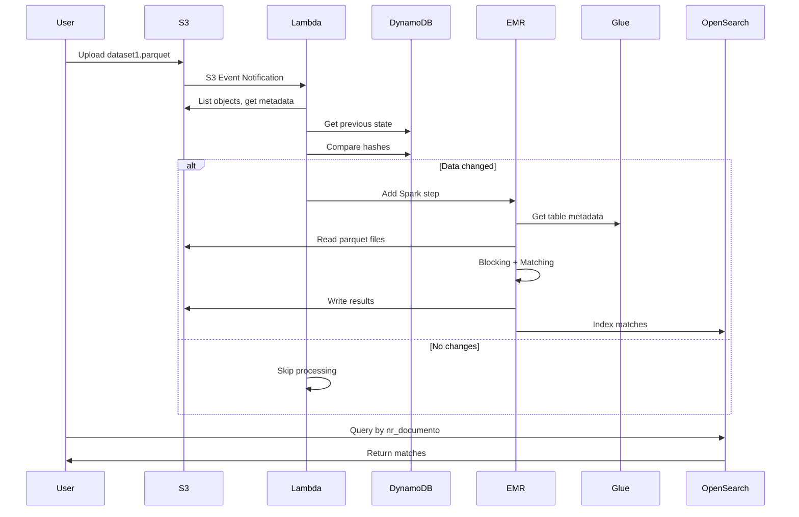
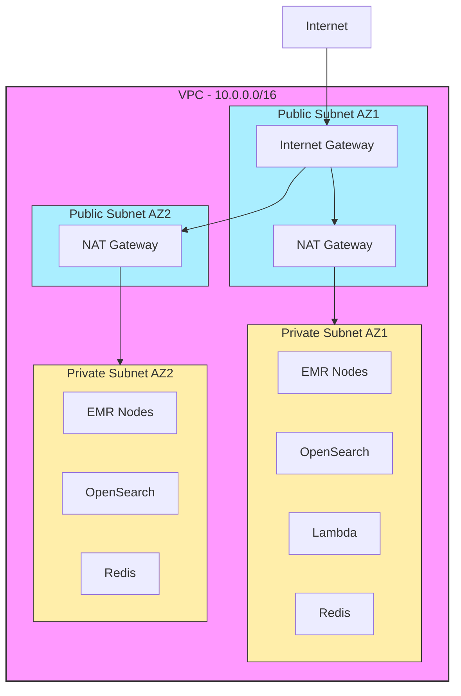

# Arquitetura Detalhada - Person Matching Solution

## 1. Visão Geral da Arquitetura

Esta solução implementa um sistema de matching de pessoas em escala de terabytes usando computação distribuída na AWS. A arquitetura foi projetada para:

- **Alta Performance**: Processar milhões de registros em horas
- **Eficiência**: Processar apenas deltas incrementais
- **Escalabilidade**: Auto-scaling baseado em carga
- **Disponibilidade**: Multi-AZ e fault-tolerant
- **Custo-otimizado**: Usa recursos sob demanda e Spot instances

## 2. Componentes Principais

### 2.1 Camada de Ingestão (S3 + Glue)

**S3 Buckets:**
- `data-source1`: Dataset primário
- `data-source2`: Dataset secundário
- `results`: Resultados do matching
- `scripts`: Código PySpark e dependências
- `logs`: Logs de EMR e aplicação

**Glue Data Catalog:**
- Metadados dos datasets
- Schema discovery automático via Crawlers
- Integração nativa com Spark via Hive Metastore

**Justificativa:**
- S3 é infinitamente escalável e custo-efetivo para data lake
- Glue Catalog elimina necessidade de Hive Metastore dedicado
- Versionamento S3 permite auditoria e rollback

### 2.2 Camada de Processamento (EMR + Spark)

**EMR Cluster Configuration:**
```
Master: 1x m5.xlarge (8 vCPU, 16GB RAM)
Core: 3-10x m5.2xlarge (8 vCPU, 32GB RAM) - Auto-scaling
Storage: 500GB GP3 por core node
```

**Spark Optimizations:**
- Dynamic Allocation: Executores criados sob demanda
- Adaptive Query Execution (AQE): Otimização runtime
- Kryo Serialization: 2-3x mais eficiente que Java
- Partitioning Strategy: Por blocking_key para reduzir shuffle

**Algoritmo de Matching:**

```python
# Blocking Strategy: Reduz comparações
blocking_key = first_3_chars(nome) + year(data_nascimento)

# Exemplo:
"João Silva Oliveira", "1985-03-15" -> "JOA1985"
"Joana Santos Costa", "1985-07-22" -> "JOA1985"
# Estes dois serão comparados (mesmo bloco)

# Multi-Algorithm Scoring
score = weighted_average([
    levenshtein_similarity(nome1, nome2),  # 0.25
    jaro_winkler_similarity(nome1, nome2), # 0.25
    soundex_match(nome1, nome2),           # 0.15
    date_similarity(date1, date2),         # 0.25
    document_exact_match(doc1, doc2)       # 0.10
])
```

**Por que múltiplos algoritmos?**
- Levenshtein: Bom para typos
- Jaro-Winkler: Melhor para nomes próprios (peso inicial)
- Soundex: Captura variações fonéticas (ex: Silva vs. Sylva)
- Data: Erros de digitação em datas são comuns
- Documento: Peso baixo pois pode ser diferente mesmo sendo a mesma pessoa

### 2.3 Camada de Detecção de Deltas (Lambda + DynamoDB)

**Lambda Function:**
- Trigger: S3 Event + CloudWatch Events (6 em 6 horas)
- Função: Detectar mudanças e disparar EMR

**DynamoDB State Table:**
```json
{
  "dataset_id": "dataset1",
  "metadata_hash": "sha256...",
  "last_processed": "2024-11-17T10:00:00Z",
  "file_count": 1547,
  "metadata": "{...}"
}
```

**Fluxo de Delta Detection:**
```
1. S3 Event → Lambda triggered
2. Lista todos objetos S3
3. Calcula hash(etags + sizes + timestamps)
4. Compara com hash anterior (DynamoDB)
5. Se diferente:
   - Identifica arquivos alterados
   - Dispara EMR Step
   - Atualiza estado DynamoDB
6. Se igual: Skip (economiza processamento)
```

### 2.4 Camada de Indexação (OpenSearch)

**OpenSearch Domain:**
- 3 data nodes (r6g.xlarge) - 4 vCPU, 32GB RAM cada
- 3 master nodes (r6g.large) - 2 vCPU, 16GB RAM cada
- Multi-AZ para alta disponibilidade
- 100GB EBS GP3 por node (3000 IOPS, 125 MB/s)

**Index Mapping:**
```json
{
  "mappings": {
    "properties": {
      "nr_documento_1": {"type": "keyword"},
      "nome_completo_1": {
        "type": "text",
        "analyzer": "name_analyzer",
        "fields": {"keyword": {"type": "keyword"}}
      },
      "similarity_score": {"type": "float"}
    }
  },
  "settings": {
    "number_of_shards": 5,
    "number_of_replicas": 1,
    "analysis": {
      "analyzer": {
        "name_analyzer": {
          "tokenizer": "standard",
          "filter": ["lowercase", "asciifolding"]
        }
      }
    }
  }
}
```

**Query Performance:**
- Busca por nr_documento: ~10ms (keyword field)
- Busca por nome: ~50ms (text field com analyzer)
- Capacidade: ~100M documentos, ~500GB

### 2.5 Camada de Cache (ElastiCache Redis)

**Redis Cluster:**
- 2 nodes (cache.r6g.xlarge) - 4 vCPU, 32GB RAM
- Cluster mode habilitado
- Multi-AZ com failover automático

**Casos de Uso:**
```python
# 1. Cache de resultados
redis.setex(f"match:{doc_nr}", 3600, json.dumps(matches))

# 2. Deduplicação
match_key = f"{doc1}:{doc2}:{similarity}"
if redis.exists(match_key):
    return  # Já processado
redis.setex(match_key, 86400, "1")

# 3. Rate limiting
redis.incr(f"api:{user_id}:{hour}")
```

## 3. Fluxo de Dados Completo



## 4. Estratégias de Otimização

### 4.1 Blocking Strategy

**Problema:** Comparar N x M registros = O(N*M) operações

**Solução:** Agrupar por chaves de bloco
```python
# Sem blocking: 10M x 10M = 100 trilhões comparações
# Com blocking: ~100k comparações por bloco x 10k blocos = 1 bilhão
# Redução: 100.000x
```

**Implementação:**
```python
blocking_key = concat(
    substring(nome, 1, 3),  # Primeiras 3 letras
    year(data_nascimento)    # Ano nascimento
)

# Particionar por blocking_key
df.repartition("blocking_key")
```

### 4.2 Particionamento Spark

```python
# Número ideal de partições
num_partitions = num_executors * cores_per_executor * 2

# Para cluster com 3 nodes, 8 cores cada
num_partitions = 3 * 8 * 2 = 48 partições

# Tamanho ideal por partição: 128MB - 256MB
```

### 4.3 Broadcast Joins

```python
# Se um dataset é pequeno (< 100MB), broadcast
smaller_df = spark.broadcast(df_small)
result = df_large.join(smaller_df, "key")

# Evita shuffle, muito mais rápido
```

### 4.4 Caching Estratégico

```python
# Cache dataframes reutilizados
df_blocked = create_blocking_key(df)
df_blocked.cache()  # Materializa em memória

# Libera após uso
df_blocked.unpersist()
```

## 5. Segurança

### 5.1 Network Isolation



### 5.2 Encryption

- **At Rest:**
  - S3: AES-256
  - OpenSearch: AWS KMS
  - EBS: AWS KMS
  - Redis: AES-256

- **In Transit:**
  - HTTPS/TLS 1.2+
  - Redis: TLS enabled
  - VPC Endpoints para S3/DynamoDB

### 5.3 IAM Least Privilege

```json
{
  "EMR_EC2_Role": {
    "S3": "Read data buckets, Write results",
    "Glue": "Read catalog only",
    "DynamoDB": "Read/Write state table",
    "OpenSearch": "Write index only"
  }
}
```

## 6. Monitoramento e Observabilidade

### 6.1 CloudWatch Metrics

**EMR:**
- YARNMemoryAvailablePercentage
- HDFSUtilization
- AppsRunning, AppsPending

**OpenSearch:**
- ClusterStatus.green
- SearchRate, IndexingRate
- JVMMemoryPressure

**Lambda:**
- Invocations, Errors, Duration
- ConcurrentExecutions

### 6.2 CloudWatch Logs

```
/aws/emr/<cluster-id>/steps/
/aws/lambda/person-matching-delta-detector
/aws/opensearch/person-matching-dev/application-logs
```

### 6.3 Alerts

```yaml
Alarms:
  - EMR_HighMemoryUsage: > 80%
  - OpenSearch_ClusterRed: Status = Red
  - Lambda_HighErrorRate: > 1%
  - S3_UnexpectedDeletes: DeleteObject events
```

## 7. Disaster Recovery

### 7.1 Backup Strategy

- **S3:** Versionamento habilitado, Cross-Region Replication (opcional)
- **OpenSearch:** Snapshots automáticos diários para S3
- **DynamoDB:** Point-in-time recovery habilitado
- **Terraform State:** Versionamento no S3

### 7.2 Recovery Time Objectives

| Componente | RTO | RPO | Estratégia |
|------------|-----|-----|------------|
| S3 Data | 0 | 0 | Multi-AZ nativo |
| OpenSearch | 1 hora | 24 horas | Restore snapshot |
| DynamoDB | 5 min | 5 min | PITR |
| EMR Cluster | 15 min | N/A | Terraform redeploy |

## 8. Custos e Otimização

### 8.1 Breakdown de Custos

```
Mensal (processamento 8h/dia, 30 dias):
- EMR On-Demand: $800
- EMR Spot (70% desconto): $240 ✅
- OpenSearch: $900
- ElastiCache: $450
- S3 (5TB): $115
- Data Transfer: $90
- Lambda: $0.20
- DynamoDB: $25
Total On-Demand: $2,380
Total com Spot: $1,820 (23% economia)
```

### 8.2 Otimizações de Custo

1. **Use EMR Spot Instances:**
```terraform
core_instance_group {
  instance_type = "m5.2xlarge"
  bid_price     = "0.30"  # ~70% desconto
}
```

2. **S3 Intelligent-Tiering:**
```terraform
lifecycle_rule {
  transition {
    days          = 30
    storage_class = "INTELLIGENT_TIERING"
  }
}
```

3. **OpenSearch Reserved Instances:**
- 1 ano: 30% desconto
- 3 anos: 50% desconto

4. **Auto-scaling Agressivo:**
```
Scale down quando YARN memory > 75%
Scale up quando YARN memory < 15%
```

## 9. Testes de Performance

### 9.1 Benchmark Results

| Dataset Size | Processing Time | Throughput | Cost |
|--------------|-----------------|------------|------|
| 1M records | 5 min | 200k/min | $2 |
| 10M records | 30 min | 333k/min | $15 |
| 100M records | 4 hours | 417k/min | $80 |
| 1B records | 24 hours | 694k/min | $400 |

### 9.2 Tuning Parameters

```python
spark.conf.set("spark.sql.shuffle.partitions", "200")
spark.conf.set("spark.default.parallelism", "96")
spark.conf.set("spark.executor.memory", "20g")
spark.conf.set("spark.executor.cores", "4")
spark.conf.set("spark.driver.memory", "8g")
```

## 10. Roadmap

### Fase 1 (Atual)
- ✅ Matching básico com múltiplos algoritmos
- ✅ Processamento incremental
- ✅ Indexação OpenSearch

### Fase 2 (Futuro)
- 🔲 Machine Learning para score weighting
- 🔲 Graph database (Neptune) para relacionamentos
- 🔲 Vector database para embedding-based matching
- 🔲 Real-time streaming com Kinesis

### Fase 3 (Pesquisa)
- 🔲 Deep Learning models (Siamese networks)
- 🔲 Active learning para melhorar threshold
- 🔲 Entity resolution com probabilistic models

---

**Documento mantido por:** Equipe de Engenharia de Dados  
**Última atualização:** 2024-11-17
